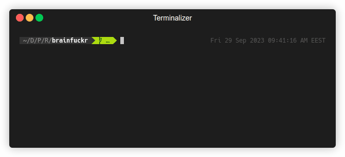

<div align='center'>

<h1>brainfuckr</h1>
<p>Yet another <em>brainfuck</em> interpreter written in Rust.</p>
<h4> <a href="https://docs.rs/brainfuckr/latest/brainfuckr/"> Documentation </a> <span> · </span> <a href="https://github.com/omgitsaheadcrab/brainfuckr/issues"> Report Bug </a> <span> · </span> <a href="https://github.com/omgitsaheadcrab/brainfuckr/issues"> Request Feature </a> </h4>
</div>

[](LICENSE)

## :toolbox: Getting Started

### :gear: Installation

To begin, clone the repository with
```bash
git clone https://github.com/omgitsaheadcrab/brainfuckr
```

### :test_tube: Running Tests

Tests can be run using cargo
```bash
cargo test
```

### :running: Usage

<p align="center">
   
</p>

Evaluate example `.b` source file 
```bash
cargo run -- --src tests/test_files/hello_world.b
```

## :warning: License

Distributed under the MIT License. See [LICENSE](LICENSE) for more information.

## :gem: Acknowledgements

- [brainfuck.org](http://brainfuck.org/)
